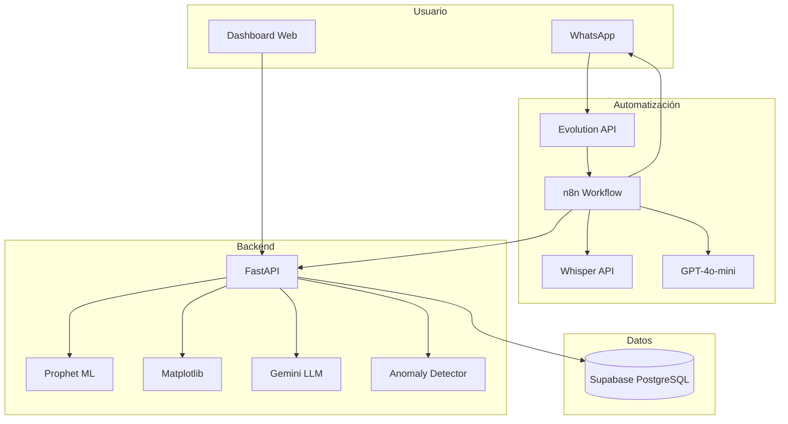

# EcoSentinel UPTC

[](https://python.org)
[](https://fastapi.tiangolo.com)
[](https://facebook.github.io/prophet/)
[](https://supabase.com)
[](https://docker.com)
[](LICENSE)

> Sistema inteligente de predicción, detección de anomalías y recomendaciones para optimizar el consumo energético y reducir la huella de carbono en las sedes de la UPTC.

---

## 🏆 IAMinds Hackathon 2026 — 2nd Place

**EcoSentinel** was built in 36 hours by **Equipo Olinky** at the **IAMinds Hackathon 2026**, organized by [Indra Group](https://www.indracompany.com/) and UPTC in Boyacá, Colombia.

- 🥈 **2nd place** out of 80 teams and 283 participants from across Latin America
- 🚀 The hackathon coincided with the **official launch of NovaIA** — Indra Group's first AI Center of Excellence in Colombia — attended by leaders from Microsoft, IBM, SAP, Bancolombia, Grupo Aval, and Colombia's Air Force, among others
- 🎯 Challenge: optimize energy consumption across university campuses using AI

### Key Design Decisions

- **WhatsApp as primary interface** — prioritized real adoption over a pure tech demo; any UPTC staff member can query predictions in natural language without installing anything
- **20 specialized Prophet models** (one per campus × sector) instead of a single general model, for higher accuracy per context
- **Ollama-compatible architecture** — designed with data sovereignty in mind, critical for public institutions

### Team Olinky

| Member | Role |
|--------|------|
| **Freddy** | Backend FastAPI + ML + Architecture |
| **Daniel** | Feature Engineering + Anomaly Detection + Optimization |
| **John** | n8n Workflows + WhatsApp Bot |

---

## El Problema

La Universidad Pedagógica y Tecnológica de Colombia (UPTC) opera **4 sedes en Boyacá** con más de **31,500 estudiantes**, y enfrenta un desperdicio energético estimado del **30%** debido a:

- Equipos encendidos fuera de horario académico
- Consumo elevado en fines de semana y vacaciones sin ocupación
- Ausencia de herramientas de predicción y monitoreo inteligente
- Falta de recomendaciones accionables basadas en datos

**Impacto estimado del desperdicio:**
- ~2,400 MWh/año en energía perdida
- ~302 toneladas CO2/año en emisiones evitables
- ~$1,560 millones COP/año en costos innecesarios

## La Solución

**EcoSentinel** es un sistema conversacional accesible vía **WhatsApp** que permite a cualquier miembro de la comunidad UPTC consultar, predecir y optimizar el consumo energético de las 4 sedes.

### 3 Pilares

| Pilar | Tecnología | Objetivo |
|-------|-----------|----------|
| **Predicción** | Prophet (20 modelos) | Anticipar consumo 1h-7 días con MAE < 15 kWh |
| **Detección** | Z-Score + Pattern Mining | Identificar anomalías y patrones ineficientes |
| **Recomendaciones** | Gemini LLM | Generar acciones específicas con ROI calculado |

## Arquitectura



## Dataset

| Atributo | Valor |
|----------|-------|
| Registros | 270,000 |
| Período | 2018-01 a 2025-10 |
| Frecuencia | Horaria |
| Sedes | Tunja, Duitama, Sogamoso, Chiquinquirá |
| Sectores | Comedores, Salones, Laboratorios, Auditorios, Oficinas |

**Variables:** timestamp, sede, energía por sector (kWh), temperatura exterior (°C), ocupación (%), periodo académico, fin de semana.

## API Endpoints

### `POST /api/chat` — Chat principal (WhatsApp)
```json
{
  "message": "Consumo comedores Tunja",
  "user_id": "whatsapp:+573001234567",
  "intent": "consumo_historico",
  "sede": "Tunja",
  "sector": "Comedores"
}
```

### `POST /api/predict` — Predicción energética
```json
{
  "sede": "Tunja",
  "sector": "Comedores",
  "hours_ahead": 24,
  "include_chart": true
}
```

### `GET /api/consumption` — Consumo histórico
```
/api/consumption?sede=Tunja&sector=Salones&dias=7
```

### `GET /api/anomalies` — Detección de anomalías
```
/api/anomalies?sede=Duitama&sector=Laboratorios&threshold=2.5
```

### `POST /api/recommendations` — Recomendaciones LLM
```json
{
  "sede": "Sogamoso",
  "sector": "Oficinas"
}
```

### `GET /health` — Health check

## Inicio Rápido

### Prerrequisitos
- Python 3.11+
- Docker y Docker Compose
- Cuenta Supabase
- API Key de Gemini

### Instalación local

```bash
# Clonar repositorio
git clone https://github.com/olinky/ecosentinel-uptc.git
cd ecosentinel-uptc

# Configurar variables de entorno
cp .env.example .env
# Editar .env con tus credenciales

# Instalar dependencias
cd backend
python -m venv venv
source venv/bin/activate
pip install -r requirements.txt

# Generar dataset sintético
python -m scripts.generate_dataset

# Entrenar modelos
python -m scripts.train_models --csv data/consumos_uptc.csv

# Iniciar servidor
uvicorn api.main:app --reload --port 8000
```

### Con Docker

```bash
cp .env.example .env
# Editar .env con tus credenciales

docker-compose up --build
```

- Backend: http://localhost:8000
- Frontend: http://localhost:8501
- Docs API: http://localhost:8000/docs

## Estructura del Proyecto

```
ecosentinel-uptc/
├── backend/
│   ├── api/
│   │   ├── main.py              # App FastAPI principal
│   │   ├── config.py            # Configuración central
│   │   ├── routers/
│   │   │   ├── chat.py          # POST /api/chat
│   │   │   ├── predictions.py   # POST /api/predict
│   │   │   ├── consumption.py   # GET /api/consumption
│   │   │   ├── anomalies.py     # GET /api/anomalies
│   │   │   └── recommendations.py
│   │   ├── ml/
│   │   │   ├── predictor.py     # Prophet model manager
│   │   │   └── anomaly_detector.py
│   │   ├── llm/
│   │   │   └── recommender.py   # Gemini integration
│   │   └── utils/
│   │       ├── db.py            # Supabase client
│   │       └── charts.py        # Matplotlib chart generation
│   ├── scripts/
│   │   ├── generate_dataset.py  # Dataset sintético
│   │   ├── load_data.py         # Carga a Supabase
│   │   └── train_models.py      # Entrenamiento masivo
│   ├── models/trained/          # Modelos .pkl
│   ├── static/charts/           # Gráficos generados
│   └── data/                    # Dataset CSV
├── frontend/
│   ├── app.py                   # Streamlit dashboard
│   ├── pages/
│   └── requirements.txt
├── n8n/                         # Workflows WhatsApp
├── docker-compose.yml
├── .env.example
└── .gitignore
```

## Modelos ML

**20 modelos Prophet** (1 por cada combinación sede × sector):

| Sede | Estudiantes | Sectores | Modelos |
|------|-------------|----------|---------|
| Tunja | 18,000 | 5 | 5 |
| Duitama | 5,500 | 5 | 5 |
| Sogamoso | 6,000 | 5 | 5 |
| Chiquinquirá | 2,000 | 5 | 5 |

**Regresores:** temperatura exterior, ocupación, fin de semana

**Métricas objetivo:** MAE < 15 kWh | R² > 0.85 | MAPE < 20%

## Stack Tecnológico

| Componente | Tecnología |
|-----------|-----------|
| Backend API | FastAPI + Uvicorn |
| ML | Prophet (time series) |
| Anomalías | Z-Score + Pattern Mining |
| LLM | Google Gemini 1.5 Flash |
| Base de datos | Supabase (PostgreSQL) |
| Gráficos | Matplotlib |
| WhatsApp | Evolution API + n8n |
| Audio | Whisper API |
| Intent Detection | GPT-4o-mini |
| Dashboard | Streamlit + Plotly |
| Deploy | Docker + Hostinger VPS |

## ROI Estimado

| Concepto | Valor |
|----------|-------|
| Reducción consumo esperada | 15-25% |
| Ahorro energético anual | ~1,200 MWh |
| Ahorro económico anual | ~$780M COP |
| Reducción CO2 anual | ~151 toneladas |

## Licencia

MIT License — Ver [LICENSE](LICENSE) para más detalles.

---

*Desarrollado con dedicación en 36 horas para el HackDay IAMinds 2026 | Indra + UPTC*
